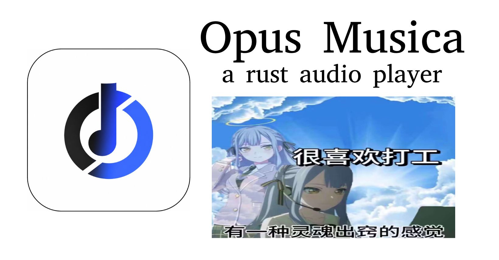

# Op Music

A Rust desktop music player with a serif, monochrome, borderless design — built with [Tauri](https://tauri.app/).



## Features

- **Local Music Library** — scan folders recursively, supports MP3 / FLAC / WAV / OGG / M4A / AAC / WMA / Opus / AIFF
- **Metadata & Cover Art** — reads ID3v2 / Vorbis Comments / MP4 tags, displays embedded album art
- **Playlists** — each scanned folder becomes a playlist; all accumulated directories persist across restarts
- **Favorites** — file-path–based, survives cache clears, auto-validates on startup
- **Word-Cloud Lyrics** — parses LRC files or embedded lyrics; splits lines into words; renders a non-overlapping word-cloud with randomized sizes, colors, and horizontal/vertical orientation
- **Realtime Spectrum** — Web Audio API AnalyserNode with bar visualization, colors follow the selected scheme
- **Dual Skin** — Light (warm white + black) and Blue (`#2f55cb` + white), toggleable
- **Color Schemes** — Bridge, Stellar, Hypr, Rdm (random), Cover (extracts palette from album art), Default (follows skin)
- **Autostart** — optional registry-based launch on boot (Windows)
- **ZIP Export** — one-click export all favorited songs as a ZIP archive
- **Keyboard Shortcuts** — Space (play/pause), Ctrl+←→ (prev/next), Ctrl+K (search)

## Tech Stack

| Layer | Technology |
|-------|-----------|
| Desktop shell | Tauri v2 |
| Backend | Rust — `lofty` (metadata), `walkdir` (scanning), `zip` (export) |
| Frontend | HTML5 + CSS3 + vanilla JavaScript |
| Audio | HTML Audio element (base64 data URL) |
| Visualizer | Web Audio API AnalyserNode |
| Styling | CSS custom properties, zero-dependency |

## Quick Start

```bash
cd src-tauri
cargo run
```

## Project Structure

```
opmusic-ds/
├── dist/                  # Frontend (served by Tauri)
│   ├── index.html
│   ├── styles.css
│   └── app.js
├── src-tauri/             # Rust backend
│   ├── src/
│   │   ├── main.rs
│   │   ├── lib.rs
│   │   ├── scanner.rs     # Directory walker + metadata reader
│   │   └── commands.rs    # Tauri IPC handlers
│   ├── Cargo.toml
│   └── tauri.conf.json
├── assets/                # Design docs, icon, theme tokens
│   ├── icon.png
│   ├── gh-page.png
│   ├── theme.css
│   └── DESIGN.md
└── README.md
```

## Build Release

```bash
cd src-tauri
cargo build --release
# Output: src-tauri/target/release/opmusic-ds.exe
```

## License

MIT
